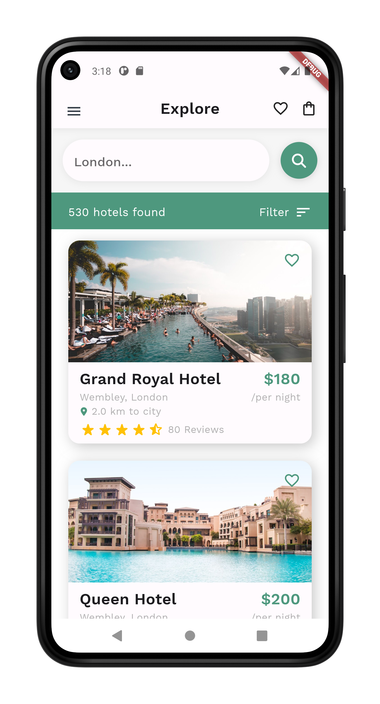
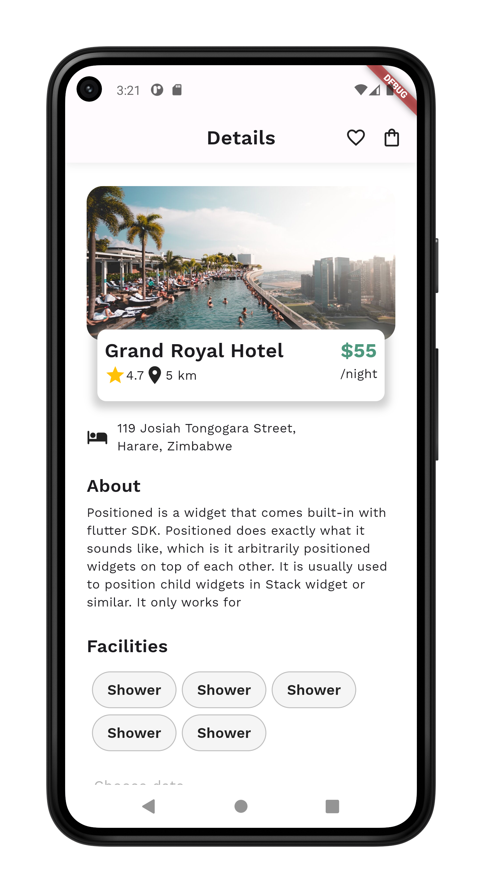
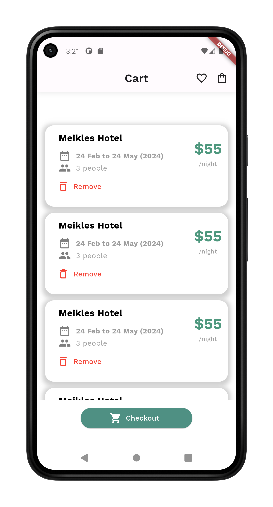

# Hotel App

Allow you to book a nearby hotel. Created using Flutter

## 👨‍💻 Stack

- Flutter


## 🧬 Samples

| Home Screen | Details Screen | Cart Screen |
|---------|---------|---------|
|         |         |         |


## 💪🏼 Getting Started

# Clone the project and cd into it

```bash
git clone https://github.com/takumade/hotel-app
cd ./hotel-app
```

# Install dependencies

```bash
flutter pub get
```

# Run

```bash
flutter run
```

## 🌻 Motivation

I am relearning Flutter, so I am practising......

## 🔗 Links

Special thanks to these links....

- [Flutter project](https://github.com/mitesh77/Best-Flutter-UI-Templates)
